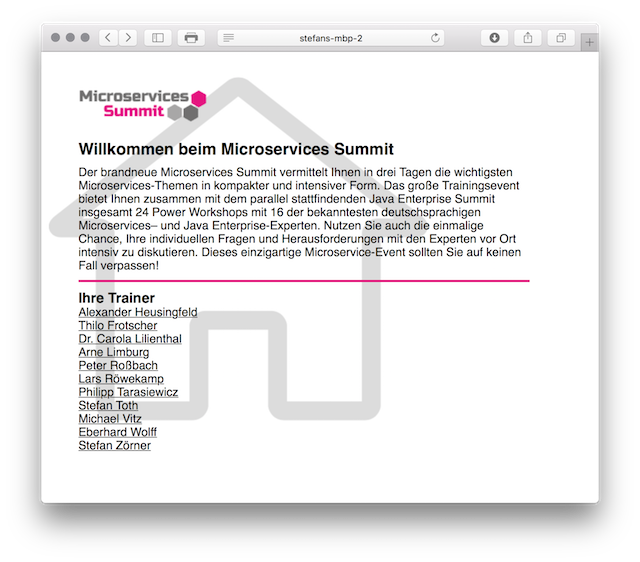

# Microservices Summit - Beispiel

Einfaches Beispiel für eine Applikation mit Netflix-Stack. 
Ursprünglich erstellt von Harm Gnoyke und Stefan Zörner für einen Workshop auf dem Microservices Summit. 
Rückmeldungen gerne an sz@embarc.de.

Start aller Services über <pre><code>run-all.sh</code></pre>

Eingesetzte Technologien:

* Spring Boot (mit Thymeleaf)
* Spring Cloud Netflix
* Netflix Eureka
* Netflix Hystrix
* Netflix Zuul
* Netflix Feign
